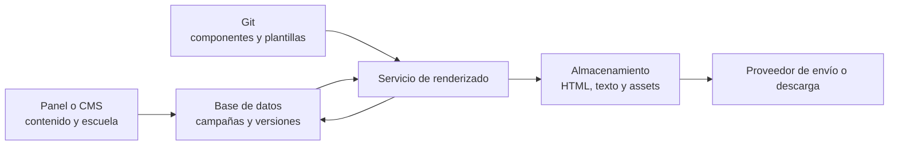

# React Email para múltiples escuelas: preguntas y respuestas de arquitectura

Documento de contexto y decisiones elaborado a partir del análisis del proyecto `react-email-starter`.

> Estado: propuesta de evolución. Las carpetas y herramientas descritas como recomendación no forman parte necesariamente del scaffold actual.

> Convención de ejemplos: el código de React se presenta por separado para TypeScript y JavaScript. Los formatos independientes del lenguaje —JSON, comandos de terminal, diagramas y nombres de ramas— se muestran una sola vez porque no cambian entre ambas variantes.

## Contexto

El repositorio comenzó como un ejemplo básico de React Email con plantillas equivalentes en JavaScript y TypeScript. El objetivo futuro es producir correos para distintas escuelas, reutilizar componentes visuales, conservar las entregas y poder modificar campañas antiguas.

Las necesidades identificadas son:

- Reutilizar componentes como listas, tarjetas, imágenes, botones, encabezados y pies.
- Personalizar colores, logos y datos para distintas escuelas.
- Conservar el HTML exacto entregado.
- Recuperar el código y los datos que produjeron una entrega anterior.
- Crear nuevas versiones sin sobrescribir entregas históricas.
- Escalar desde unas pocas entregas manuales hasta decenas o cientos de campañas mensuales.

---

## 1. ¿React Email es adecuado para crear una biblioteca propia de componentes?

Sí. React Email es una tecnología apropiada para construir un sistema de componentes reutilizables para correos.

Se pueden crear componentes propios como:

- Tarjetas con imagen, texto y botón.
- Listas numeradas o con iconos.
- Encabezados y pies institucionales.
- Bloques de avisos, eventos y noticias.
- Secciones de dos o tres columnas.
- Botones con distintas variantes.
- Layouts y temas configurables por escuela.

Un componente podría consumirse de esta manera:

**TypeScript (`.tsx`)**

```tsx
<ImageCard
  imageUrl="https://cdn.example.com/evento.jpg"
  title="Feria de ciencias"
  description="Te esperamos el próximo viernes."
  button={{
    label: "Ver detalles",
    href: "https://escuela.edu/eventos",
  }}
/>
```

**JavaScript (`.jsx`)**

```jsx
<ImageCard
  imageUrl="https://cdn.example.com/evento.jpg"
  title="Feria de ciencias"
  description="Te esperamos el próximo viernes."
  button={{
    label: "Ver detalles",
    href: "https://escuela.edu/eventos",
  }}
/>
```

### Modelo recomendado

La solución debería evolucionar hacia cuatro capas:

1. **Componentes:** piezas visuales reutilizables.
2. **Layouts:** estructuras generales del documento.
3. **Plantillas:** correos completos para un caso de uso.
4. **Temas y datos:** identidad de cada escuela y contenido de cada campaña.

Ejemplo conceptual:

**TypeScript**

```text
emails/
├── components/
│   ├── EmailButton.tsx
│   ├── ImageCard.tsx
│   ├── FeatureList.tsx
│   ├── SchoolHeader.tsx
│   └── SchoolFooter.tsx
├── layouts/
│   └── BaseEmailLayout.tsx
└── templates/
    ├── EventAnnouncementEmail.tsx
    ├── MonthlyNewsletterEmail.tsx
    └── PaymentReminderEmail.tsx
```

**JavaScript**

```text
emails/
├── components/
│   ├── EmailButton.jsx
│   ├── ImageCard.jsx
│   ├── FeatureList.jsx
│   ├── SchoolHeader.jsx
│   └── SchoolFooter.jsx
├── layouts/
│   └── BaseEmailLayout.jsx
└── templates/
    ├── EventAnnouncementEmail.jsx
    ├── MonthlyNewsletterEmail.jsx
    └── PaymentReminderEmail.jsx
```

### Restricción importante

Aunque las plantillas se escriben con React, el resultado sigue siendo HTML para correo y no una aplicación web. Por ello:

- No se puede depender de JavaScript interactivo en el correo.
- Muchos clientes soportan solamente una parte de CSS.
- Outlook y otros clientes pueden requerir estructuras basadas en tablas.
- Algunas fuentes web y reglas responsive pueden fallar.
- Las imágenes finales deberían tener URLs públicas HTTPS y estables.
- La revisión en el navegador no sustituye las pruebas en clientes de correo.

React Email ayuda a abstraer varias de estas diferencias mediante componentes como `Section`, `Row`, `Column`, `Img` y `Button`, pero no elimina las restricciones propias del medio.

### Decisión

Conservar React Email y convertir progresivamente el starter en una biblioteca de componentes, temas escolares y plantillas parametrizadas.

---

## 2. ¿Conviene tener una carpeta o una rama permanente por cada escuela?

Se recomienda un solo repositorio y una sola rama principal. No se recomienda mantener una rama permanente por escuela.

### Por qué no usar ramas permanentes

Si existieran veinte ramas escolares, una corrección compartida —por ejemplo, compatibilidad con Outlook o una mejora de accesibilidad— tendría que replicarse y resolverse en las veinte ramas. Con el tiempo, estas ramas divergirían y cada escuela terminaría utilizando una versión distinta del sistema.

Las ramas deberían representar trabajos temporales:

```text
feat/colegio-norte-newsletter
update/escuela-central-footer
fix/colegio-sur-outlook-spacing
```

Después de aprobar el cambio, la rama se integra en `main` y se elimina.

### Cuándo sí utilizar carpetas escolares

Una carpeta por escuela es adecuada para almacenar solamente sus diferencias:

**TypeScript**

```text
schools/
├── colegio-norte/
│   ├── theme.ts
│   ├── config.ts
│   └── assets/
├── escuela-central/
│   ├── theme.ts
│   ├── config.ts
│   └── assets/
└── colegio-sur/
    ├── theme.ts
    ├── config.ts
    └── assets/
```

**JavaScript**

```text
schools/
├── colegio-norte/
│   ├── theme.js
│   ├── config.js
│   └── assets/
├── escuela-central/
│   ├── theme.js
│   ├── config.js
│   └── assets/
└── colegio-sur/
    ├── theme.js
    ├── config.js
    └── assets/
```

Una configuración puede incluir:

**TypeScript**

```ts
export const colegioNorte = {
  id: "colegio-norte",
  name: "Colegio Norte",
  colors: {
    primary: "#174A7E",
    secondary: "#F4B942",
  },
  logoUrl: "https://cdn.example.com/colegio-norte/logo-v2.png",
  websiteUrl: "https://colegionorte.edu.mx",
  contactEmail: "contacto@colegionorte.edu.mx",
};
```

**JavaScript**

```js
export const colegioNorte = {
  id: "colegio-norte",
  name: "Colegio Norte",
  colors: {
    primary: "#174A7E",
    secondary: "#F4B942",
  },
  logoUrl: "https://cdn.example.com/colegio-norte/logo-v2.png",
  websiteUrl: "https://colegionorte.edu.mx",
  contactEmail: "contacto@colegionorte.edu.mx",
};
```

La misma plantilla puede recibir temas y contenidos diferentes:

**TypeScript (`.tsx`)**

```tsx
<MonthlyNewsletterEmail
  school={colegioNorte}
  title="Noticias de agosto"
  articles={articles}
/>
```

**JavaScript (`.jsx`)**

```jsx
<MonthlyNewsletterEmail
  school={colegioNorte}
  title="Noticias de agosto"
  articles={articles}
/>
```

### Regla para evitar duplicación

- Cambio de logo, color o texto: configuración o datos.
- Cambio visual que puede reutilizarse: variante de un componente.
- Composición realmente exclusiva: plantilla u override específico.
- No duplicar una plantilla completa solamente para cambiar identidad o contenido.

### Excepción organizacional

Podría justificarse separar repositorios si existen límites estrictos de acceso, propietarios técnicos diferentes o contratos que exijan aislamiento. El número de escuelas por sí solo no obliga a separar el código.

---

## 3. ¿Cómo deberían nombrarse los archivos de componentes?

Para este proyecto se recomienda **PascalCase** en archivos que exportan componentes React, haciendo coincidir el archivo y el símbolo exportado.

**TypeScript**

```text
ImageCard.tsx          → export function ImageCard()
FeatureList.tsx        → export function FeatureList()
SchoolHeader.tsx       → export function SchoolHeader()
MonthlyNewsletterEmail.tsx → export function MonthlyNewsletterEmail()
```

**JavaScript**

```text
ImageCard.jsx          → export function ImageCard()
FeatureList.jsx        → export function FeatureList()
SchoolHeader.jsx       → export function SchoolHeader()
MonthlyNewsletterEmail.jsx → export function MonthlyNewsletterEmail()
```

### Motivos

- Permite reconocer inmediatamente un componente.
- Mantiene una relación directa entre archivo, exportación e importación.
- Facilita búsquedas y refactors.
- Distingue componentes de utilidades, configuraciones y datos.
- Coincide con la convención de JSX, donde los componentes comienzan con mayúscula.

Regla resumida:

> Si se utiliza como `<Algo />`, su archivo debería llamarse `Algo.tsx` en TypeScript o `Algo.jsx` en JavaScript.

### Convenciones complementarias

| Elemento | Convención | TypeScript | JavaScript |
| --- | --- | --- | --- |
| Componente React | PascalCase | `ImageCard.tsx` | `ImageCard.jsx` |
| Plantilla completa | PascalCase + `Email` | `EventAnnouncementEmail.tsx` | `EventAnnouncementEmail.jsx` |
| Layout | PascalCase | `BaseEmailLayout.tsx` | `BaseEmailLayout.jsx` |
| Tipo o contrato documentado | PascalCase | `type SchoolTheme` | `@typedef SchoolTheme` |
| Función o utilidad | camelCase | `renderDelivery.ts` | `renderDelivery.js` |
| Carpeta genérica | minúsculas o kebab-case | `components/`, `school-themes/` | Igual |
| Identificador de escuela | kebab-case | `colegio-norte/` | Igual |
| Imagen o asset | kebab-case | `logo-colegio-norte.png` | Igual |

Los nombres actuales del starter no son incorrectos, pero al evolucionar el proyecto podrían cambiarse:

**TypeScript**

```text
ejemplo-email-typescript.tsx          → ExampleEmail.tsx
ejemplo-list-component-typescript.tsx → CompetencyList.tsx
```

**JavaScript**

```text
ejemplo-email-javascript.jsx          → ExampleEmail.jsx
ejemplo-list-component-javascript.jsx → CompetencyList.jsx
```

---

## 4. ¿Cómo se conserva una entrega para modificarla posteriormente?

El HTML entregado no sustituye al código editable. Deben conservarse dos cosas diferentes:

- `emails/`: código fuente editable.
- `deliveries/`: resultado exacto entregado.

Git conserva las versiones históricas del código fuente. Por tanto, no es necesario copiar `EmailEscuelaA.tsx` o `EmailEscuelaA.jsx` dentro de cada entrega. Esa duplicación crearía archivos desconectados que podrían divergir.

### Estructura para un volumen inicial

**TypeScript**

```text
emails/
├── components/
├── layouts/
├── templates/
└── campaigns/
    └── colegio-norte/
        └── graduacion-2026/
            ├── GraduationEmail.tsx
            └── content.ts

schools/
└── colegio-norte/
    ├── theme.ts
    └── assets/

deliveries/
└── colegio-norte/
    └── graduacion-2026/
        ├── v1/
        │   ├── email.html
        │   ├── email.txt
        │   ├── data.json
        │   └── manifest.json
        └── v2/
            ├── email.html
            ├── email.txt
            ├── data.json
            └── manifest.json
```

**JavaScript**

```text
emails/
├── components/
├── layouts/
├── templates/
└── campaigns/
    └── colegio-norte/
        └── graduacion-2026/
            ├── GraduationEmail.jsx
            └── content.js

schools/
└── colegio-norte/
    ├── theme.js
    └── assets/

deliveries/
└── colegio-norte/
    └── graduacion-2026/
        ├── v1/
        │   ├── email.html
        │   ├── email.txt
        │   ├── data.json
        │   └── manifest.json
        └── v2/
            ├── email.html
            ├── email.txt
            ├── data.json
            └── manifest.json
```

### Responsabilidad de cada elemento

- `GraduationEmail.tsx` o `GraduationEmail.jsx`: fuente editable del diseño particular.
- `content.ts`, `content.js` o `data.json`: contenido de la campaña.
- `theme.ts` o `theme.js`: identidad visual de la escuela.
- `email.html`: archivo exacto entregado.
- `email.txt`: alternativa de texto plano.
- `manifest.json`: vínculo entre entrega, fuente, datos y versión.

Ejemplo de manifiesto para TypeScript:

```json
{
  "school": "colegio-norte",
  "campaign": "graduacion-2026",
  "version": 2,
  "template": "emails/campaigns/colegio-norte/graduacion-2026/GraduationEmail.tsx",
  "gitCommit": "abc1234",
  "deliveredAt": "2026-07-28",
  "notes": "Se actualizaron la fecha y el encabezado"
}
```

Ejemplo equivalente para JavaScript:

```json
{
  "school": "colegio-norte",
  "campaign": "graduacion-2026",
  "version": 2,
  "template": "emails/campaigns/colegio-norte/graduacion-2026/GraduationEmail.jsx",
  "gitCommit": "abc1234",
  "deliveredAt": "2026-07-28",
  "notes": "Se actualizaron la fecha y el encabezado"
}
```

### Tags de Git

Cada entrega aprobada debería asociarse a un tag:

```text
colegio-norte/graduacion-2026/v1
colegio-norte/graduacion-2026/v2
```

El tag permite recuperar exactamente los componentes, la plantilla y la configuración utilizados en una entrega, aunque el proyecto continúe evolucionando.

### Flujo de modificación

Cuando una escuela solicita cambios:

1. Localizar la entrega anterior y su manifiesto.
2. Consultar el commit o tag que la generó.
3. Crear una rama temporal para el cambio.
4. Actualizar plantilla, tema o contenido según corresponda.
5. Revisar el preview.
6. Generar nuevamente HTML y texto plano.
7. Registrar el resultado como una nueva versión.
8. Crear un nuevo commit y tag.

Una entrega ya emitida no se sobrescribe:

```text
v1 → entrega original
v2 → cambio de fecha
v3 → cambio de imagen y botón
```

### Cuándo guardar una plantilla específica

Si varias escuelas comparten la estructura, debe existir una plantilla parametrizada:

**TypeScript**

```text
emails/templates/EventAnnouncementEmail.tsx
```

**JavaScript**

```text
emails/templates/EventAnnouncementEmail.jsx
```

Si una campaña tiene una composición genuinamente exclusiva y se espera editarla después, puede conservar su propio entry point:

**TypeScript**

```text
emails/campaigns/colegio-norte/graduacion-2026/GraduationEmail.tsx
```

**JavaScript**

```text
emails/campaigns/colegio-norte/graduacion-2026/GraduationEmail.jsx
```

Incluso esa plantilla específica debe importar los componentes compartidos en lugar de copiarlos.

### Reproducción exacta

Para volver a producir el mismo resultado se necesita conservar:

- Código fuente.
- Datos de entrada.
- Configuración de la escuela.
- Imágenes y assets versionados.
- Versión de Node.js.
- Versiones exactas de dependencias.
- Commit o tag.
- HTML final.

El `package-lock.json` debería versionarse. Actualmente se encuentra ignorado, lo cual reduce la reproducibilidad de instalaciones futuras.

No deben guardarse en Git datos personales de estudiantes, destinatarios o familias. Los datos usados para preview y reproducción deben ser ficticios, anonimizados o almacenarse en un sistema seguro.

---

## 5. ¿Qué ocurre si el proyecto escala hasta 100 emails al mes?

Primero se deben distinguir dos escenarios:

- Cien destinatarios del mismo correo representan un volumen pequeño.
- Cien campañas o entregables diferentes al mes requieren automatizar la administración.

React Email puede seguir siendo el motor de plantillas. Lo que debe evolucionar es la gestión de contenido, versiones, aprobaciones y artefactos.

### Problema de crear 100 archivos JSX nuevos

Si cada mes se necesitan cien diseños React completamente diferentes, existe una señal de falta de estandarización. Lo deseable es que la mayoría de las entregas utilicen un catálogo reducido de plantillas:

```text
NewsletterEmail
EventAnnouncementEmail
PaymentReminderEmail
WelcomeEmail
EmergencyNoticeEmail
AcademicReportEmail
```

Cada campaña sería principalmente un conjunto de datos:

```json
{
  "school": "colegio-norte",
  "template": "EventAnnouncementEmail",
  "subject": "Ceremonia de graduación",
  "title": "Generación 2026",
  "description": "Acompáñanos a celebrar...",
  "imageUrl": "https://cdn.example.com/graduacion-2026.jpg",
  "button": {
    "label": "Consultar detalles",
    "href": "https://colegionorte.edu.mx/graduacion"
  }
}
```

### Cuando `deliveries/` deja de ser suficiente

Para un volumen pequeño, versionar HTML dentro del repositorio es sencillo. Con cien entregas mensuales se producirían aproximadamente 1,200 entregas por año. Esto puede causar:

- Commits y pull requests con demasiado ruido.
- Crecimiento innecesario del repositorio.
- Búsquedas difíciles.
- Conflictos entre artefactos generados.
- Mezcla de código fuente con archivos de entrega.

En ese punto, Git debería conservar los componentes, plantillas y temas. Los artefactos generados deberían almacenarse en almacenamiento de objetos privado, y una base de datos debería mantener el registro.



### Registro de entrega a mayor escala

```json
{
  "id": "delivery_01J...",
  "schoolId": "colegio-norte",
  "campaignId": "graduacion-2026",
  "version": 3,
  "status": "delivered",
  "template": "EventAnnouncementEmail",
  "templateVersion": "2.4.0",
  "gitCommit": "abc1234",
  "dataSnapshot": "storage://deliveries/.../data.json",
  "htmlArtifact": "storage://deliveries/.../email.html",
  "textArtifact": "storage://deliveries/.../email.txt",
  "createdAt": "2026-07-28T18:00:00Z"
}
```

### Automatizaciones necesarias

- Crear campañas a partir de una plantilla.
- Validar los datos requeridos por cada plantilla.
- Previsualizar por escuela, plantilla y dispositivo.
- Generar HTML y texto plano.
- Validar enlaces e imágenes.
- Versionar cada revisión automáticamente.
- Gestionar estados como `draft`, `review`, `approved` y `delivered`.
- Registrar quién creó, aprobó o modificó una versión.
- Almacenar assets mediante URLs inmutables.
- Ejecutar pruebas visuales y de compatibilidad.
- Procesar renderizados por lotes o mediante una cola de trabajos.

Posibles comandos durante una etapa intermedia:

```sh
npm run campaign:create
npm run campaign:preview -- colegio-norte graduacion-2026
npm run campaign:deliver -- colegio-norte graduacion-2026
```

### Evolución progresiva

| Volumen aproximado | Estrategia |
| --- | --- |
| Hasta 20 entregas al mes | Git, tags y `deliveries/` |
| 20–50 entregas al mes | Scripts, datos separados y manifiestos automáticos |
| 50–100 entregas al mes | Base de datos o CMS, almacenamiento externo y flujo de aprobación |
| Más de 100 entregas al mes | Panel administrativo, renderizador, cola de trabajos y auditoría |

Los umbrales no son reglas rígidas. El punto de transición depende de cuánto trabajo manual, cuántos errores y cuántas personas participan en el proceso.

---

## 6. ¿Conviene que un componente tenga estilos propios o que el email padre controle sus estilos?

Conviene utilizar un enfoque híbrido: **el componente hijo debe ser responsable de su estructura y de sus estilos base**, mientras el email padre debería personalizarlo mediante propiedades y variantes controladas.

No es recomendable que cada email tenga que reconstruir todos los estilos internos del componente. Eso reduciría la reutilización y permitiría que una modificación accidental rompiera la compatibilidad con algún cliente de correo.

### Responsabilidad del componente hijo

El componente debería controlar:

- La estructura compatible con email mediante `Section`, `Row`, `Column`, tablas u otras primitivas apropiadas.
- Espaciado y alineación base.
- Tamaños mínimos y máximos seguros.
- Estilos tipográficos predeterminados.
- Comportamiento de imágenes y botones.
- Fallbacks y decisiones necesarias para clientes como Outlook.
- Valores predeterminados que permitan utilizarlo sin configurar cada detalle.

Por ejemplo, `ImageCard` debería funcionar correctamente con sus propiedades mínimas:

**TypeScript (`.tsx`)**

```tsx
<ImageCard
  title="Feria de ciencias"
  description="Te esperamos el próximo viernes."
  imageUrl="https://cdn.example.com/feria.jpg"
  imageAlt="Estudiantes presentando un proyecto de ciencias"
/>
```

**JavaScript (`.jsx`)**

```jsx
<ImageCard
  title="Feria de ciencias"
  description="Te esperamos el próximo viernes."
  imageUrl="https://cdn.example.com/feria.jpg"
  imageAlt="Estudiantes presentando un proyecto de ciencias"
/>
```

### Responsabilidad del email padre

El padre debería decidir:

- Contenido.
- Tema de la escuela.
- Variante visual.
- Orientación o alineación.
- Si se muestra una acción.
- Valores legítimamente diferentes entre campañas.

Ejemplo:

**TypeScript (`.tsx`)**

```tsx
<ImageCard
  title="Feria de ciencias"
  description="Te esperamos el próximo viernes."
  imageUrl="https://cdn.example.com/feria.jpg"
  imageAlt="Estudiantes presentando un proyecto de ciencias"
  variant="horizontal"
  align="left"
  tone="primary"
  button={{
    label: "Ver detalles",
    href: "https://escuela.edu/eventos",
  }}
  theme={schoolTheme}
/>
```

**JavaScript (`.jsx`)**

```jsx
<ImageCard
  title="Feria de ciencias"
  description="Te esperamos el próximo viernes."
  imageUrl="https://cdn.example.com/feria.jpg"
  imageAlt="Estudiantes presentando un proyecto de ciencias"
  variant="horizontal"
  align="left"
  tone="primary"
  button={{
    label: "Ver detalles",
    href: "https://escuela.edu/eventos",
  }}
  theme={schoolTheme}
/>
```

### API recomendada

En lugar de exponer todas las clases internas, conviene diseñar propiedades semánticas:

**TypeScript**

```tsx
type ImageCardProps = {
  title: string;
  description?: string;
  imageUrl: string;
  imageAlt: string;
  variant?: "vertical" | "horizontal";
  align?: "left" | "center";
  tone?: "default" | "primary" | "highlight";
  button?: {
    label: string;
    href: string;
  };
  theme: SchoolTheme;
  style?: React.CSSProperties;
};
```

**JavaScript con JSDoc**

```js
/**
 * @typedef {Object} ImageCardProps
 * @property {string} title
 * @property {string} [description]
 * @property {string} imageUrl
 * @property {string} imageAlt
 * @property {"vertical" | "horizontal"} [variant]
 * @property {"left" | "center"} [align]
 * @property {"default" | "primary" | "highlight"} [tone]
 * @property {{ label: string, href: string }} [button]
 * @property {SchoolTheme} theme
 * @property {import("react").CSSProperties} [style]
 */

/** @param {ImageCardProps} props */
export function ImageCard(props) {
  // Implementación del componente.
}
```

Las propiedades `variant`, `align` y `tone` expresan intención. Esto es preferible a pedir al padre que conozca detalles como el padding de una celda o el color exacto de un borde.

### Exponer `style` o `className`

Puede aceptarse un `style` para modificar el contenedor raíz como mecanismo de escape:

**TypeScript (`.tsx`)**

```tsx
<ImageCard
  {...props}
  style={{ marginBottom: "32px" }}
/>
```

**JavaScript (`.jsx`)**

```jsx
<ImageCard
  {...props}
  style={{ marginBottom: "32px" }}
/>
```

El componente puede combinarlo después de sus estilos predeterminados:

**TypeScript (`.tsx`)**

```tsx
<Section style={{ ...styles.container, ...style }}>
  {/* contenido */}
</Section>
```

**JavaScript (`.jsx`)**

```jsx
<Section style={{ ...styles.container, ...style }}>
  {/* contenido */}
</Section>
```

Sin embargo, `style` no debería ser la API principal. Permitir sobrescribir cada elemento interno produciría componentes difíciles de mantener y haría posible romper sus garantías de compatibilidad.

La misma regla aplica a `className`: puede ser útil para el elemento raíz, pero no debería obligar al padre a controlar toda la presentación. Además, los valores dinámicos de marca, como colores provenientes de la configuración de una escuela, suelen ser más explícitos mediante estilos inline o tokens resueltos que mediante nombres de clases construidos dinámicamente.

### Temas en lugar de estilos repetidos

Los cambios de identidad no deberían escribirse manualmente en cada llamada. Deben provenir de un tema:

**TypeScript**

```ts
type SchoolTheme = {
  colors: {
    primary: string;
    secondary: string;
    background: string;
    text: string;
  };
  typography: {
    fontFamily: string;
  };
  borderRadius: {
    card: string;
    button: string;
  };
};
```

**JavaScript con JSDoc**

```js
/**
 * @typedef {Object} SchoolTheme
 * @property {{
 *   primary: string,
 *   secondary: string,
 *   background: string,
 *   text: string
 * }} colors
 * @property {{ fontFamily: string }} typography
 * @property {{ card: string, button: string }} borderRadius
 */
```

La plantilla selecciona el tema escolar y los componentes consumen los valores necesarios. Se recomienda pasar estos valores de manera explícita o transformarlos en props. No se debería depender sin validación de selectores heredados o de comportamiento CSS habitual de una aplicación web, porque el HTML final será transformado para clientes de correo.

### Cuándo crear una variante

Si una diferencia aparece varias veces, debería convertirse en una variante oficial:

**TypeScript (`.tsx`)**

```tsx
<ImageCard variant="horizontal" />
<ImageCard variant="vertical" />
<ImageCard tone="highlight" />
```

**JavaScript (`.jsx`)**

```jsx
<ImageCard variant="horizontal" />
<ImageCard variant="vertical" />
<ImageCard tone="highlight" />
```

Si una diferencia ocurre una sola vez, puede utilizarse el escape `style`. Si la personalización modifica completamente la estructura, probablemente corresponde crear otro componente en lugar de agregar numerosas propiedades booleanas.

### Regla de decisión

| Necesidad | Solución recomendada |
| --- | --- |
| Estructura y compatibilidad | Estilos internos del componente |
| Colores y tipografía de una escuela | `SchoolTheme` |
| Diferencia reutilizable de diseño | Propiedad `variant` o `tone` |
| Separación respecto a otros bloques | `style` en el contenedor raíz |
| Cambio completo de estructura | Nuevo componente o composición |
| Ajuste único y excepcional | Override limitado y documentado |

### Decisión

Los componentes deben ser funcionales y visualmente correctos por sí mismos. El padre configura su intención mediante contenido, tema y variantes; no administra libremente todos sus estilos internos.

Esta estrategia proporciona reutilización sin convertir los componentes en bloques rígidos y protege las decisiones de compatibilidad necesarias para HTML email.

---

## 7. ¿Cada componente debe incluir `Html`, `Head` y `Body`? ¿Cómo se visualizan los componentes sin duplicarlos?

Los componentes reutilizables deberían contener **solamente su fragmento de contenido**. `Html`, `Head` y `Body` deben aparecer una sola vez en el documento final, normalmente dentro de un layout compartido como `BaseEmailLayout`.

No conviene que `ImageCard`, `FeatureList` o `SchoolHeader` creen su propio documento HTML. Al utilizarlos dentro de una plantilla se producirían documentos anidados y dejarían de funcionar como bloques verdaderamente componibles.

La separación recomendada es:

- **Componente:** devuelve `Section`, `Row`, `Column`, `Text`, `Img` u otro contenido parcial.
- **Layout:** contiene `Html`, `Head`, `Preview`, `Tailwind`, `Body` y el contenedor general.
- **Plantilla:** combina layout, componentes y datos para producir un correo completo.
- **Catálogo de componentes:** es un único email de desarrollo que reúne componentes y variantes para mostrarlos en la interfaz local.

### No es obligatorio usar `_components/`

El CLI de React Email recorre `emails/` y muestra en la barra lateral los archivos `.js`, `.jsx` o `.tsx` que contienen una exportación por defecto. También permite ocultar un directorio completo si su nombre comienza con `_`.

En la captura del proyecto solamente aparecen `ejemplo-email-javascript` y `ejemplo-email-typescript` porque ambos archivos exportan su plantilla por defecto. Los archivos de lista utilizan únicamente exportaciones nombradas, por lo que no aparecen como emails seleccionables.

El prefijo `_components/` es una protección adicional documentada por React Email, pero no es obligatorio. Para este proyecto se puede utilizar una sola carpeta `components/` si se conserva esta regla:

- Los componentes reutilizables usan exportaciones nombradas.
- Solamente las plantillas y catálogos que deban aparecer en la barra lateral usan `export default`.

### Estructura recomendada

**TypeScript**

```text
emails/
├── components/
│   ├── ImageCard.tsx            # Exportación nombrada; no aparece
│   ├── FeatureList.tsx          # Exportación nombrada; no aparece
│   ├── SchoolFooter.tsx         # Exportación nombrada; no aparece
│   └── ComponentCatalogEmail.tsx # Exportación default; sí aparece
├── layouts/
│   └── BaseEmailLayout.tsx      # Documento base compartido
└── templates/
    └── EventEmail.tsx           # Email real; sí aparece
```

**JavaScript**

```text
emails/
├── components/
│   ├── ImageCard.jsx            # Exportación nombrada; no aparece
│   ├── FeatureList.jsx          # Exportación nombrada; no aparece
│   ├── SchoolFooter.jsx         # Exportación nombrada; no aparece
│   └── ComponentCatalogEmail.jsx # Exportación default; sí aparece
├── layouts/
│   └── BaseEmailLayout.jsx      # Documento base compartido
└── templates/
    └── EventEmail.jsx           # Email real; sí aparece
```

### Componente reutilizable: solamente contenido

**TypeScript (`ImageCard.tsx`)**

```tsx
import type { CSSProperties } from "react";
import { Img, Section, Text } from "react-email";

type ImageCardProps = {
  title: string;
  description: string;
  imageUrl: string;
  imageAlt: string;
  variant?: "default" | "highlight";
};

export function ImageCard({
  title,
  description,
  imageUrl,
  imageAlt,
  variant = "default",
}: ImageCardProps) {
  return (
    <Section
      style={{
        ...styles.card,
        ...(variant === "highlight" ? styles.highlightedCard : {}),
      }}
    >
      
      <Text style={styles.title}>{title}</Text>
      <Text style={styles.description}>{description}</Text>
    </Section>
  );
}

const styles = {
  card: {
    backgroundColor: "#ffffff",
    border: "1px solid #e5e7eb",
    borderRadius: "8px",
    padding: "24px",
  },
  highlightedCard: {
    backgroundColor: "#eef2ff",
    borderColor: "#4f46e5",
  },
  image: {
    display: "block",
    width: "100%",
    height: "auto",
  },
  title: {
    color: "#111827",
    fontSize: "20px",
    fontWeight: "700",
    margin: "20px 0 8px",
  },
  description: {
    color: "#4b5563",
    fontSize: "14px",
    lineHeight: "22px",
    margin: "0",
  },
} satisfies Record<
  "card" | "highlightedCard" | "image" | "title" | "description",
  CSSProperties
>;
```

**JavaScript (`ImageCard.jsx`)**

```jsx
import { Img, Section, Text } from "react-email";

export function ImageCard({
  title,
  description,
  imageUrl,
  imageAlt,
  variant = "default",
}) {
  return (
    <Section
      style={{
        ...styles.card,
        ...(variant === "highlight" ? styles.highlightedCard : {}),
      }}
    >
      
      <Text style={styles.title}>{title}</Text>
      <Text style={styles.description}>{description}</Text>
    </Section>
  );
}

const styles = {
  card: {
    backgroundColor: "#ffffff",
    border: "1px solid #e5e7eb",
    borderRadius: "8px",
    padding: "24px",
  },
  highlightedCard: {
    backgroundColor: "#eef2ff",
    borderColor: "#4f46e5",
  },
  image: {
    display: "block",
    width: "100%",
    height: "auto",
  },
  title: {
    color: "#111827",
    fontSize: "20px",
    fontWeight: "700",
    margin: "20px 0 8px",
  },
  description: {
    color: "#4b5563",
    fontSize: "14px",
    lineHeight: "22px",
    margin: "0",
  },
};
```

`ImageCard` utiliza una exportación nombrada y no contiene `Html`, `Head` ni `Body`. Puede insertarse varias veces en cualquier plantilla.

### Layout compartido: un solo documento HTML

**TypeScript (`BaseEmailLayout.tsx`)**

```tsx
import type { CSSProperties, ReactNode } from "react";
import {
  Body,
  Container,
  Head,
  Html,
  Preview,
  Tailwind,
} from "react-email";

type BaseEmailLayoutProps = {
  children: ReactNode;
  previewText: string;
};

export function BaseEmailLayout({
  children,
  previewText,
}: BaseEmailLayoutProps) {
  return (
    <Html lang="es">
      <Head />
      <Preview>{previewText}</Preview>
      <Tailwind>
        <Body style={styles.body}>
          <Container style={styles.container}>{children}</Container>
        </Body>
      </Tailwind>
    </Html>
  );
}

const styles = {
  body: {
    backgroundColor: "#f3f4f6",
    fontFamily: "Arial, sans-serif",
    margin: "0",
  },
  container: {
    margin: "0 auto",
    maxWidth: "600px",
    padding: "24px",
  },
} satisfies Record<"body" | "container", CSSProperties>;
```

**JavaScript (`BaseEmailLayout.jsx`)**

```jsx
import {
  Body,
  Container,
  Head,
  Html,
  Preview,
  Tailwind,
} from "react-email";

export function BaseEmailLayout({ children, previewText }) {
  return (
    <Html lang="es">
      <Head />
      <Preview>{previewText}</Preview>
      <Tailwind>
        <Body style={styles.body}>
          <Container style={styles.container}>{children}</Container>
        </Body>
      </Tailwind>
    </Html>
  );
}

const styles = {
  body: {
    backgroundColor: "#f3f4f6",
    fontFamily: "Arial, sans-serif",
    margin: "0",
  },
  container: {
    margin: "0 auto",
    maxWidth: "600px",
    padding: "24px",
  },
};
```

### Un solo catálogo visual

No es necesario crear un archivo de preview por cada componente. Un único `ComponentCatalogEmail` puede importar los componentes reales y mostrar sus variantes. No hay una segunda implementación: el catálogo solamente los compone con datos ficticios.

**TypeScript (`ComponentCatalogEmail.tsx`)**

```tsx
import { Heading, Hr } from "react-email";

import { BaseEmailLayout } from "../layouts/BaseEmailLayout";
import { ImageCard } from "./ImageCard";

export default function ComponentCatalogEmail() {
  return (
    <BaseEmailLayout previewText="Catálogo interno de componentes">
      <Heading as="h1">Catálogo de componentes</Heading>

      <Heading as="h2">ImageCard predeterminada</Heading>
      <ImageCard
        title="Feria de ciencias"
        description="Te esperamos el próximo viernes."
        imageUrl="/static/ing_ciberseguridad.jpg"
        imageAlt="Ilustración de ciberseguridad"
      />

      <Hr />

      <Heading as="h2">ImageCard destacada</Heading>
      <ImageCard
        title="Taller de ciberseguridad"
        description="Recomendaciones para proteger tu información."
        imageUrl="/static/ing_ciberseguridad.jpg"
        imageAlt="Ilustración de ciberseguridad"
        variant="highlight"
      />

    </BaseEmailLayout>
  );
}
```

**JavaScript (`ComponentCatalogEmail.jsx`)**

```jsx
import { Heading, Hr } from "react-email";

import { BaseEmailLayout } from "../layouts/BaseEmailLayout";
import { ImageCard } from "./ImageCard";

export default function ComponentCatalogEmail() {
  return (
    <BaseEmailLayout previewText="Catálogo interno de componentes">
      <Heading as="h1">Catálogo de componentes</Heading>

      <Heading as="h2">ImageCard predeterminada</Heading>
      <ImageCard
        title="Feria de ciencias"
        description="Te esperamos el próximo viernes."
        imageUrl="/static/ing_ciberseguridad.jpg"
        imageAlt="Ilustración de ciberseguridad"
      />

      <Hr />

      <Heading as="h2">ImageCard destacada</Heading>
      <ImageCard
        title="Taller de ciberseguridad"
        description="Recomendaciones para proteger tu información."
        imageUrl="/static/ing_ciberseguridad.jpg"
        imageAlt="Ilustración de ciberseguridad"
        variant="highlight"
      />

    </BaseEmailLayout>
  );
}
```

Los demás componentes se importan en este mismo catálogo y se muestran con casos representativos siguiendo el mismo patrón.

Al ejecutar `npm run dev`, la barra lateral debería mostrar solamente las entradas con exportación por defecto:

```text
components/
└── ComponentCatalogEmail

templates/
└── EventEmail
```

Si el catálogo crece demasiado, se puede dividir por categorías sin crear un wrapper para cada componente:

**TypeScript**

```text
components/
├── CardsCatalogEmail.tsx
├── FootersCatalogEmail.tsx
├── ListsCatalogEmail.tsx
├── ImageCard.tsx
├── FeatureList.tsx
└── SchoolFooter.tsx
```

**JavaScript**

```text
components/
├── CardsCatalogEmail.jsx
├── FootersCatalogEmail.jsx
├── ListsCatalogEmail.jsx
├── ImageCard.jsx
├── FeatureList.jsx
└── SchoolFooter.jsx
```

### Datos de demostración

El catálogo debe utilizar datos ficticios representativos para probar:

- Textos cortos y largos.
- Presencia y ausencia de propiedades opcionales.
- Imágenes con distintas proporciones.
- Variantes de color y layout.
- Diferentes escuelas o temas.

Para una plantilla completa que recibe props, React Email también permite asignar `Email.PreviewProps`. El servidor utiliza esos datos al abrir la plantilla en desarrollo. El catálogo puede importar fixtures compartidos para mostrar múltiples componentes y variantes en un solo documento.

### Relación con el catálogo oficial de React Email

Los ejemplos de [React Email Components](https://react.email/components) son fragmentos reutilizables para copiar y pegar, no emails completos. Por eso pueden comenzar con `Tailwind`, `Section` u otro bloque sin declarar `Html`, `Head` y `Body`.

La página de documentación proporciona el entorno visual que muestra esos fragmentos. En este proyecto, `ComponentCatalogEmail` cumple una función equivalente: proporciona un documento completo alrededor de los componentes reales.

El ejemplo oficial incluye `Tailwind` para ser autocontenido y procesar sus clases. Si `BaseEmailLayout` ya envuelve todo el contenido con `Tailwind`, los componentes internos no necesitan repetirlo. La jerarquía recomendada es:

```text
BaseEmailLayout
└── Html
    ├── Head
    └── Tailwind
        └── Body
            ├── ImageCard
            ├── FeatureList
            └── SchoolFooter
```

### Diferencia entre preview de desarrollo y `<Preview>`

No deben confundirse estos conceptos:

- `ComponentCatalogEmail.tsx` o `ComponentCatalogEmail.jsx` es un email de desarrollo creado para visualizar la biblioteca en la aplicación local.
- El componente `<Preview>` de React Email genera el texto corto que algunos clientes muestran junto al asunto en la bandeja de entrada.

### Impacto en la exportación

Como los archivos de catálogo contienen `export default`, el CLI puede tratarlos como emails cuando se ejecuta una exportación global. Al automatizar entregas, conviene renderizar explícitamente solo la plantilla aprobada mediante `render()` o configurar un flujo que excluya los catálogos. Son herramientas de desarrollo y no deben entregarse como campañas reales.

### Decisión

Los componentes reutilizables viven una sola vez dentro de `emails/components/`, contienen solamente su contenido y usan exportaciones nombradas. Un layout compartido contiene una sola instancia de `Html`, `Head`, `Tailwind` y `Body`. Un único `ComponentCatalogEmail.tsx` o `ComponentCatalogEmail.jsx` con exportación por defecto reúne los componentes y sus variantes para mostrarlos en la barra lateral.

Si el catálogo se vuelve demasiado extenso, se divide por categorías, no necesariamente por componente. Este comportamiento coincide con las reglas de descubrimiento documentadas por el [CLI de React Email](https://react.email/docs/cli).

---

## 8. ¿El nombre del archivo de un componente debe coincidir con la función que se exporta?

No es una obligación técnica, pero sí es la convención recomendada: el archivo, el componente y su exportación pública principal deberían compartir el mismo nombre.

**TypeScript**

```tsx
// ImageCard.tsx

type ImageCardProps = {
  title: string;
};

export function ImageCard({ title }: ImageCardProps) {
  return <div>{title}</div>;
}
```

**JavaScript**

```jsx
// ImageCard.jsx

export function ImageCard({ title }) {
  return <div>{title}</div>;
}
```

Esto produce imports predecibles:

**TypeScript**

```tsx
import { ImageCard } from "./components/ImageCard";
```

**JavaScript**

```jsx
import { ImageCard } from "./components/ImageCard";
```

### Motivos para mantener la coincidencia

- Facilita encontrar la implementación.
- Mejora las búsquedas y refactors.
- Evita memorizar relaciones entre nombres diferentes.
- Hace más claros los errores y React DevTools.
- Permite reconocer el componente principal de un archivo.
- Reduce confusión entre exportaciones nombradas y predeterminadas.

Aunque funciona, se debería evitar una relación como esta:

**TypeScript**

```tsx
// ImageCard.tsx

export function CardWithPhoto() {
  return <div>{/* contenido */}</div>;
}
```

**JavaScript**

```jsx
// ImageCard.jsx

export function CardWithPhoto() {
  return <div>{/* contenido */}</div>;
}
```

El nombre `CardWithPhoto` obliga a recordar que su implementación se encuentra en `ImageCard`, lo que añade fricción innecesaria.

### Exportaciones nombradas y predeterminadas

Para componentes reutilizables se recomiendan exportaciones nombradas:

**TypeScript**

```tsx
// ImageCard.tsx

export function ImageCard() {
  return <div>{/* contenido */}</div>;
}
```

**JavaScript**

```jsx
// ImageCard.jsx

export function ImageCard() {
  return <div>{/* contenido */}</div>;
}
```

Para emails completos que React Email debe descubrir en la barra lateral se utiliza una exportación predeterminada, pero la función también debería conservar un nombre explícito:

**TypeScript**

```tsx
// NewsletterEmail.tsx

export default function NewsletterEmail() {
  return <BaseEmailLayout>{/* contenido */}</BaseEmailLayout>;
}
```

**JavaScript**

```jsx
// NewsletterEmail.jsx

export default function NewsletterEmail() {
  return <BaseEmailLayout>{/* contenido */}</BaseEmailLayout>;
}
```

Se deberían evitar funciones predeterminadas anónimas porque dificultan su identificación en errores y herramientas de desarrollo:

**TypeScript**

```tsx
export default function () {
  return <div>{/* contenido */}</div>;
}
```

**JavaScript**

```jsx
export default function () {
  return <div>{/* contenido */}</div>;
}
```

### Componentes auxiliares privados

Un mismo archivo puede contener componentes auxiliares cuando solamente sirven a su componente principal:

**TypeScript**

```tsx
// ImageCard.tsx

function CardTitle() {
  return <div>{/* título */}</div>;
}

function CardImage() {
  return <div>{/* imagen */}</div>;
}

export function ImageCard() {
  return (
    <div>
      <CardImage />
      <CardTitle />
    </div>
  );
}
```

**JavaScript**

```jsx
// ImageCard.jsx

function CardTitle() {
  return <div>{/* título */}</div>;
}

function CardImage() {
  return <div>{/* imagen */}</div>;
}

export function ImageCard() {
  return (
    <div>
      <CardImage />
      <CardTitle />
    </div>
  );
}
```

El archivo continúa llamándose `ImageCard` porque ese es su componente público principal. `CardTitle` y `CardImage` pueden permanecer privados mientras no se reutilicen en otros módulos.

### Alias locales

Un import puede renombrarse si un contexto específico necesita otra denominación:

**TypeScript**

```tsx
import { ImageCard as EventCard } from "./ImageCard";
```

**JavaScript**

```jsx
import { ImageCard as EventCard } from "./ImageCard";
```

Esto no cambia el nombre original del componente; solamente crea un alias dentro del archivo que lo importa.

### Decisión

`ImageCard.tsx` o `ImageCard.jsx` debería exportar públicamente `ImageCard`. Si un archivo contiene helpers privados, se nombra según su componente público principal. Las excepciones deben responder a una necesidad concreta, no a diferencias accidentales de nomenclatura.

---

## Arquitectura objetivo resumida

```text
Código compartido
├── componentes
├── layouts
├── plantillas
└── contratos de datos

Identidad por escuela
├── configuración
├── tema
└── assets

Campañas
├── contenido
├── estado de aprobación
└── historial de versiones

Entregas
├── HTML
├── texto plano
├── snapshot de datos
├── manifiesto
└── referencia al commit y versión de plantilla
```

## Decisiones principales

1. Mantener React Email como motor de plantillas.
2. Adoptar TypeScript como variante principal conforme madure el proyecto.
3. Nombrar componentes y plantillas con PascalCase.
4. Mantener un solo repositorio y una rama principal.
5. Usar ramas temporales por cambio, no una rama permanente por escuela.
6. Representar diferencias escolares mediante temas, configuración y assets.
7. Separar plantilla, contenido y artefacto final.
8. No sobrescribir entregas; crear versiones inmutables.
9. Relacionar cada entrega con un commit o tag.
10. Versionar el lockfile y el entorno necesario para reproducir resultados.
11. No almacenar información personal sensible dentro del repositorio.
12. Mover los artefactos fuera de Git cuando el volumen lo justifique.
13. Mantener estructura y estilos base dentro de cada componente, ofreciendo personalización mediante temas, variantes y overrides limitados.
14. Reservar `Html`, `Head`, `Tailwind` y `Body` para el layout raíz y visualizar la biblioteca mediante un catálogo que importe los componentes reales.
15. Hacer coincidir el nombre del archivo con su componente público principal y mantener nombres explícitos tanto en exportaciones nombradas como predeterminadas.

## Siguiente etapa sugerida para este repositorio

Antes de construir una plataforma completa, el siguiente incremento razonable sería:

1. Consolidar los ejemplos principales en TypeScript.
2. Crear carpetas para `components`, `layouts` y `templates` dentro de `emails/`.
3. Extraer un primer componente reutilizable, como `ImageCard`.
4. Crear un tipo `SchoolTheme` y dos configuraciones ficticias de escuela.
5. Convertir una plantilla para recibir tema y contenido mediante props.
6. Crear un `ComponentCatalogEmail` que muestre los componentes y sus variantes.
7. Crear un script de renderizado que genere HTML y texto plano.
8. Crear automáticamente el manifiesto de una entrega.
9. Versionar `package-lock.json` y fijar la versión de Node.js.

Esta etapa permitiría validar la arquitectura con casos reales antes de introducir una base de datos, un CMS o un servicio de renderizado.

## Referencias

- [React Email: catálogo de componentes](https://react.email/components)
- [React Email: introducción y componentes base](https://react.email/docs/introduction)
- [React Email: Tailwind](https://react.email/docs/components/tailwind)
- [React Email: CLI](https://react.email/docs/cli)
- [React Email: renderizado a HTML y texto plano](https://react.email/docs/utilities/render)
- [React Email: integraciones](https://react.email/docs/integrations/overview)
