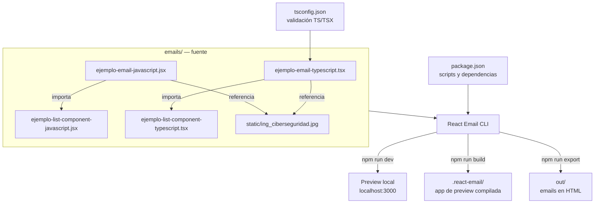

# React Email Starter

Starter mínimo para desarrollar, previsualizar y exportar plantillas de correo con React Email. El repositorio contiene el mismo ejemplo en JavaScript y TypeScript para mostrar ambos flujos y servir como base para crear correos y componentes reutilizables.

Este documento también funciona como contexto inicial del proyecto. Describe únicamente el estado actual del repositorio; no presupone una arquitectura futura.

## Objetivo del proyecto

- Crear emails como componentes de React.
- Previsualizar cambios localmente sin enviar correos reales.
- Componer una plantilla a partir de componentes reutilizables.
- Aplicar estilos compatibles con email mediante propiedades inline y clases procesadas por `Tailwind` de React Email.
- Exportar las plantillas a HTML listo para integrarse con un proveedor de envío.

El proyecto no contiene todavía lógica de envío, backend, persistencia, pruebas automatizadas ni integración con un proveedor de correo.

## Stack actual

| Pieza | Versión / función |
| --- | --- |
| React | `19.2.4` |
| React DOM | `19.2.4` |
| React Email | `6.9.1`; componentes, preview, build y exportación |
| React Email UI | `6.9.1`; dependencia de desarrollo del preview |
| TypeScript | Configuración estricta mediante `tsconfig.json`; el paquete no está declarado directamente |
| JavaScript / JSX | Alternativa equivalente a los ejemplos TypeScript |

No hay una versión de Node.js fijada en el repositorio (`.nvmrc`, `engines` o equivalente). Antes de agregar una restricción, validar la versión soportada por las dependencias actuales y por el entorno donde se desplegará.

## Scaffolding actual

```text
react-email-starter/
├── emails/                                   # Código fuente reconocido por React Email
│   ├── ejemplo-email-javascript.jsx          # Plantilla completa en JavaScript
│   ├── ejemplo-email-typescript.tsx          # Plantilla completa en TypeScript
│   ├── ejemplo-list-component-javascript.jsx # Lista reutilizable en JavaScript
│   ├── ejemplo-list-component-typescript.tsx # Lista reutilizable y tipada
│   └── static/
│       └── ing_ciberseguridad.jpg             # Imagen usada por las plantillas de ejemplo
├── .gitignore                                # Ignora node_modules y package-lock.json
├── package.json                              # Dependencias y comandos del proyecto
├── readme.md                                 # Contexto y guía del repositorio
└── tsconfig.json                             # TypeScript estricto, JSX de React y sin emisión
```

Directorios generados localmente y, por tanto, fuera del código fuente:

- `node_modules/`: dependencias instaladas.
- `.react-email/`: aplicación de preview generada por `npm run build`.
- `out/`: HTML generado por `npm run export`.

`node_modules/` está ignorado explícitamente. React Email genera `.react-email/` y `out/`; no deben tratarse como fuente ni editarse manualmente. Esos dos directorios generados no figuran actualmente en `.gitignore`, así que se debe evitar incluirlos en commits salvo que una tarea lo requiera de forma explícita.

## Diagrama de estructura y flujo



## Cómo funcionan los ejemplos

Las dos plantillas principales exportan `NewEmail` como exportación nombrada y por defecto. Cada una:

1. Envuelve el documento con `Tailwind`, `Html`, `Head` y `Body`.
2. Declara la fuente web Roboto con fallback a Verdana.
3. Muestra la imagen de `emails/static/`.
4. Renderiza el placeholder literal `{firstName}` en el saludo.
5. Incluye un botón, separadores y filas de tres columnas.
6. Entrega el arreglo local `competencias` al componente de lista correspondiente.

Los componentes de lista recorren `competencias` y presentan número, título y descripción. La variante TypeScript define localmente los tipos `Competencia` y `ListComponentProps`; la variante JavaScript recibe las mismas propiedades sin tipado estático.

Actualmente JavaScript y TypeScript son implementaciones paralelas, no dos capas que deban combinarse. Si se modifica el ejemplo compartido, decidir de forma explícita si el cambio debe replicarse en ambas variantes.

## Primeros pasos

Requisitos: Node.js y npm. El repositorio no fija todavía sus versiones.

```sh
npm install
npm run dev
```

Abrir [http://localhost:3000](http://localhost:3000) para revisar las plantillas.

## Comandos disponibles

| Comando | Resultado |
| --- | --- |
| `npm run dev` | Inicia la aplicación de preview de React Email. |
| `npm run build` | Compila la aplicación de preview dentro de `.react-email/`. |
| `npm run export` | Renderiza las plantillas como HTML dentro de `out/`. |

No hay scripts de `test`, `lint`, `format` ni `typecheck` definidos en `package.json`.

## Convenciones para extender el proyecto

### Agregar una plantilla

1. Crear un archivo `.tsx` o `.jsx` directamente en `emails/`.
2. Exportar el componente del email por defecto para que React Email lo descubra en el preview.
3. Construir el documento con componentes de `react-email` (`Html`, `Head`, `Body`, `Container`, `Section`, etc.).
4. Colocar imágenes locales en `emails/static/` y verificar su ruta tanto en preview como en el HTML exportado.
5. Ejecutar `npm run dev` para revisar el resultado y `npm run export` para validar el artefacto final.

### Agregar componentes reutilizables

- Mantenerlos dentro de `emails/` mientras no exista una carpeta de componentes acordada.
- Importarlos desde las plantillas que los consuman.
- En TypeScript, tipar las propiedades de entrada y conservar el modo estricto.
- Priorizar estructuras y estilos compatibles con clientes de correo; una página web normal y un email HTML no comparten las mismas capacidades de CSS.

### Datos dinámicos

`firstName` y `competencias` son datos de demostración definidos en el mismo archivo. No existe aún un contrato de propiedades para `NewEmail` ni una fuente externa de datos. Si una integración necesita personalización real, convertir esos valores en props tipadas antes de conectar el proveedor de envío.

## Notas 

- La fuente de verdad para scripts y versiones es `package.json`.
- La fuente de verdad para alcance de TypeScript es `tsconfig.json`; solo incluye archivos `.ts` y `.tsx`, por lo que no valida los ejemplos `.jsx`.
- No asumir que existe un framework de aplicación (Next.js, Vite, Express, etc.). La interfaz local pertenece al CLI de React Email.
- No editar `.react-email/`, `out/` ni `node_modules/`; son artefactos regenerables.
- Preservar las variantes JavaScript y TypeScript salvo que la tarea solicite consolidarlas.
- No introducir lógica de envío ni secretos de proveedores dentro de una plantilla.
- Tras cambios visuales, revisar el preview y exportar el HTML. Los clientes de correo tienen restricciones distintas a los navegadores.
- Antes de agregar herramientas, carpetas o convenciones nuevas, actualizar este documento para que el scaffolding siga reflejando el repositorio real.

## Estado y límites conocidos

- Es un scaffold educativo, no una integración de producción completa.
- El texto, enlace, imagen y arreglo de competencias son contenido de ejemplo.
- El placeholder `{firstName}` no se sustituye automáticamente.
- No hay pipeline de CI/CD ni suite de calidad automatizada.
- No hay configuración de proveedor de envío ni variables de entorno.
- La imagen incluye metadatos y tiene dimensiones originales de `1152 × 408`; las plantillas la renderizan a `600 × 305`.

## Licencia

MIT License.
